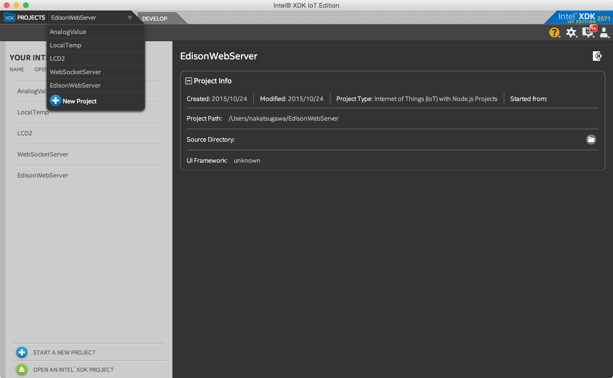
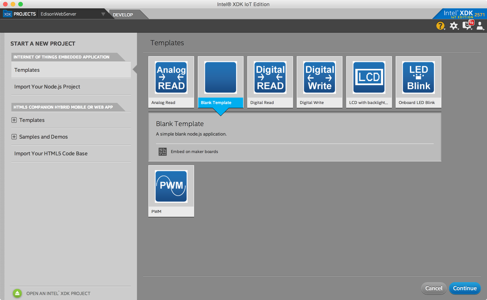
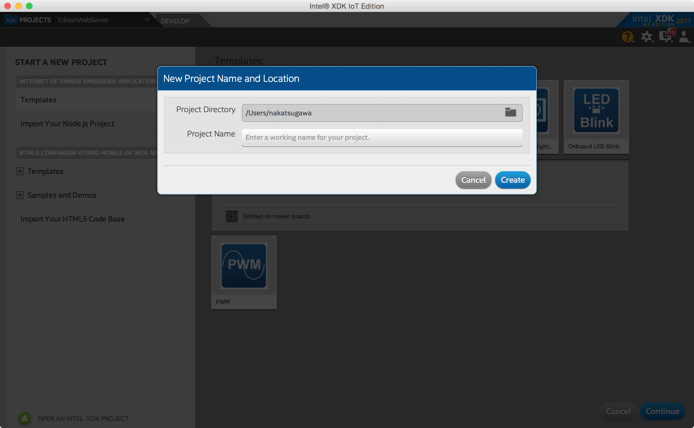
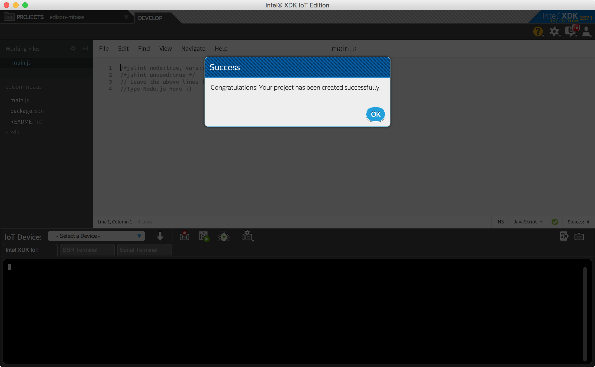
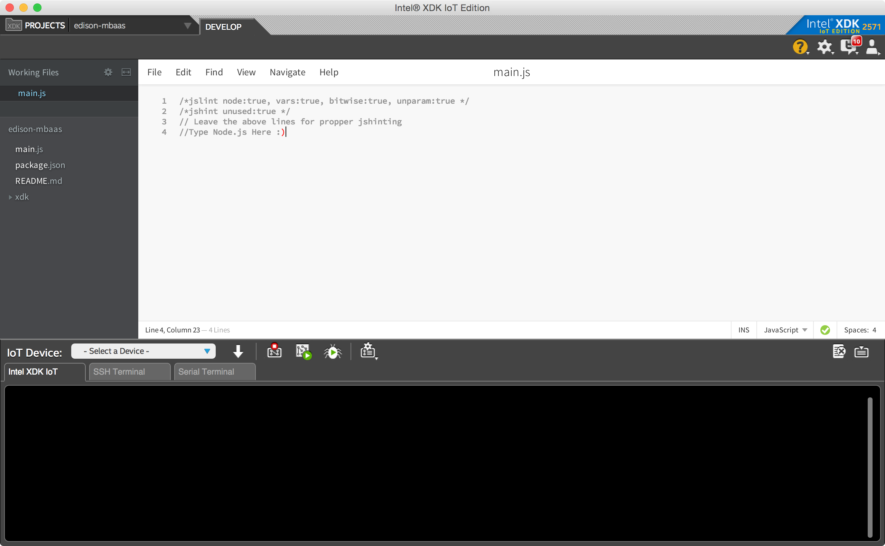
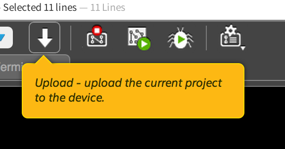
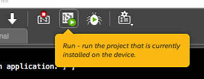
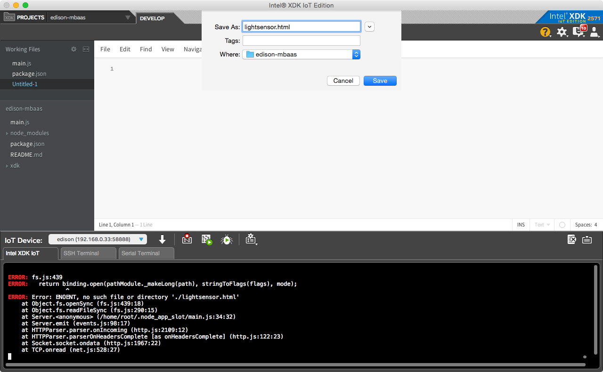

## ここまでで終わっていること

- Intel Edisonへのイメージ適用
- XDKのインストール
- Intel Edisonと母艦の接続

## Intel Edisonの設定

Intel Edisonと母艦を接続したら、次のように入力します。/dev/usb.se まで入力したら、Tabキーを押すと補完されるはずです。-Lまで入力したらエンターキーを押します。

```
screen /dev/usb.serial-**** 115200 -L
```

そうすると次のような表示になるでしょう。

```
edison login:
```

そうしたらrootと入力してエンターキーを押します。これはrootというユーザでログインすることを意味しています。今はパスワードが設定されていないので、すぐに次のような表示になります。

```
# 
```

### パスワードの設定

まずパスワードを設定します。これをやらないとIntel Edisonに外部（XDK）から接続できません。次のように入力します。configure_まで入力したらタブキーを押すとconfigure_edisonと入力されるはずです。後は ` --password` と入力してエンターキーを押してください。

```
configure_edison --password
```

新しいパスワードの入力が求められるので、適当なものを設定してください。これは2回入力します。

### 名前の設定

みんなで同じLANネットワークにつなぎますので、コンピュータ名を分ける必要があります。自分のものだと分かるように指定してください。これは次のコマンドで行います。

```
configure_edison --name
```

### WiFiの設定

Intel Edisonが接続するネットワークを設定します。SSIDはedison、パスワードはaaaaaaaa（a×8回）を入力してください。

```
configure_edison --wifi
```

ここまで終わったら次のように入力して、最後にエンターキーを押してください。

```
ping nifty.com
```

こんな感じに結果が表示されたら無事、ネットワークに接続されています。

```
# ping nifty.com
PING nifty.com (222.158.213.148): 56 data bytes
64 bytes from 222.158.213.148: seq=0 ttl=244 time=33.420 ms
^C
--- nifty.com ping statistics ---
1 packets transmitted, 1 packets received, 0% packet loss
round-trip min/avg/max = 33.420/33.420/33.420 ms
```

### XDKの起動

XDKを起動します。時間が結構かかるので注意してください。

起動したら、新規プロジェクトを選択します。



テンプレートはBlankを選択します。Continueをクリックします。



Project Nameは適当に決めてください（edison-mbaasなど）。



そうするとプロジェクト作成できましたというアラートが出ます。



これがプロジェクト画面です。ここでコードを編集して、そのままIntel Edisonにアップロードできます。



## プロジェクトを編集する

では早速プロジェクトを作っていきます。まず、package.jsonをダブルクリックしてください。そして中身を編集します。

```
{
  "name": "blankapp",
  "description": "",
  "version": "0.0.0",
  "main": "main.js",
  "engines": {
    "node": ">=0.10.0"
  },
  "dependencies": {
      "ncmb": "2.0.1" // <-- これを追加
  }
}
```

終わったらファイルを保存して、Intel Edisonにつないでみましょう。

IoT Deviceというのをクリックすると、同じネットワーク内のIntel Edisonがリストアップされるはずです。なければRescan for Devicesを選んでみましょう。そして自分で名前をつけたIntel Edisonを選択してください。

出てきたウィンドウで、設定したパスワードを入力してください。ユーザ名はrootのままでOKです。

接続されたというダイアログが出たら、Dismissをクリックしてダイアログを消します。

接続されたらUploadというボタンをクリックします。これでIntel Edisonにコードがアップロードされます。と同時にpackage.jsonに記載したncmbというmBaaS操作用のライブラリがインストールされますので少々お待ちください。また、たぶんこれは失敗します。

### ncmbのインストール

ターミナルアプリまたはPuttyで接続されているウィンドウに表示を切り替えてください。そして、/node_app_slotという場所に移動します。

```
cd /node_app_slot
```

移動したら、ncmbをインストールします。

```
npm install
```

少し待つとインストールが完了します。

## ニフティクラウド mobile backendに接続してみよう

これでライブラリの準備が完了しましたので、ニフティクラウド mobile backendに接続してみたいと思います。main.jsを次のように書き換えてください。

```
// ライブラリの読み込み
var NCMB = require('ncmb');

// アプリケーションキー、クライアントキーはmBaaSの管理画面から取得してください。
var application_key = "AAAAAAA",
    client_key = "BBBBBBB";

// アプリケーションキー、クライアントキーを使って初期化します。
var ncmb = new NCMB(application_key, client_key);

// データストアを使います。"Message" というのは自分で自由に決められます。
// Messageはデータベースでいうところのテーブルです。
var Message = ncmb.DataStore("Message");

// messageを作成します。データベースで言うところのレコードです。
var message = new Message();

// setというメソッドを使ってmessageのデータを自由に定義できます。
// "text" というのは自由に変更できるカラム名です。
message.set("text", "Connected!");

// 保存を実行します。
message.save()
  // thenは保存処理が成功した時に呼ばれます。
  .then(function() {
    // 今回はconsole.logにメッセージを出しています。
    console.log("Save sucessful. Check console panel.");
  })
  // catchは保存処理が失敗した時に呼ばれます。
  .catch(function(err) {
    // 引数のerrにエラーメッセージが入ります。
    console.error("Error: ", err);
  });
```

この内容をそのまま貼り付けて、アプリケーションキーとクライアントキーは自分の持っているものに変更してください。保存したらUploadボタンを押して、その後Runボタンを押します。





処理が実行され、問題がなければXDKのコンソールにSave successful〜と出るはずです。

## mBaaSの管理画面で確認する

ではちゃんとデータが保存できているか、mBaaSの管理画面を見てみましょう。

これだけでIntel Edisonからクラウドのサーバ上にデータが保存できました。後は好きなセンサーからデータを集めてmBaaSに保存すると言ったことも簡単にできます。テキスト、数値データはもちろんJSONやバイナリ（写真など）を保存することもできます。

## HTTPサーバを立ててみる

では続いてmain.jsの内容を次のように変更してみます。アプリケーションキー、クライアントキーはそれぞれ管理画面のものに書き換えてください。

```
// Intel Edisonからセンサーを扱うのに便利なのがmraaというライブラリです。
// 今回は使いませんが。
var mraa = require('mraa'); //require mraa
console.log('MRAA Version: ' + mraa.getVersion());

// ファイルを読み込むのに使うライブラリがfsです。
var fs = require('fs');

// URL周りの処理（パースなど）を行うのがurlです。
var url = require('url');

// mBaaSを扱う準備です。
var NCMB = require('ncmb');

var application_key = "アプリケーションキーに書き換えてください",
    client_key = "クラインとキーに書き換えてください";
// アプリケーションキーとクライアントキーで初期化します
var ncmb = new NCMB(application_key, client_key);
// 再度データストアでMessageクラスを準備します。データベースのテーブル相当です。
var Message = ncmb.DataStore("Message");

// HTTP サーバを準備します。
var http = require('http');

// ここではごくごく簡単なHTTPサーバを設定します。
http.createServer(function (req, res) {
    // ブラウザからのアクセスがあるとここの処理に入ります。
    // ↓URLにlightsensorという文字があるかどうかチェックしています。
    if (req.url.indexOf('lightsensor') != -1) {
      // lightsensorという文字があればこちらの処理
      // HTMLを返します、と宣言します
      res.writeHead(200, {'Content-Type': 'text/html'});
      // lightsensor.htmlというファイルを読み込みます
      var lightSensorPage = fs.readFileSync('./lightsensor.html');
      // 読み込んだファイルの内容をそのまま返します
      res.end(lightSensorPage);
    // こちらはURLにmessageという文字があるかどうかチェックしています
    } else if (req.url.indexOf('message') != -1) {
      // messageという文字があればこちらの処理
      // URLのクエリパラメータをチェックしています。（http://example.com/?hello=world といった時の?以降）
      var queryObject = url.parse(req.url,true).query;
      // メッセージを作成します。
      var message = new Message();
      // textカラムにクエリパラメータのmessageをセットします
      message.set("text", queryObject['message']);
      var data = fs.readFileSync("/etc/hostname");
      message.set("name", data.toString('ascii', 0, data.length));
      // 保存処理の実行
      message.save()
        // 保存処理が成功した場合はこちら
        .then(function() {
          // メッセージを返して終わり
          res.end(JSON.stringify({message: "Save sucessful. Check console panel."}));
        })
        // 保存処理が失敗した場合はこちら
        .catch(function(err) {
          // エラーメッセージを出力
          console.error("Error: ", err);
        });
    // その他、JavaScript SDKを指定された場合
    } else if (req.url.indexOf('ncmb.min.js') != -1) {
      // Webブラウザ用のJavaScript SDKを返します
      res.end(fs.readFileSync("node_modules/ncmb/ncmb.min.js"));
    }
}).listen(1337, "127.0.0.1");
```

それぞれの処理の内容はコメントをみてください。全部で3つのアクセスが想定されています。

1. http://(Intel EdisonのIPアドレス):1337/lightsensor
1. http://(Intel EdisonのIPアドレス):1337/message?message=○○○
1. http://(Intel EdisonのIPアドレス):1337/ncmb.min.js

1はHTMLファイルを返します。2はmBaaSへのメッセージ保存処理を行います。3はWebブラウザ向けのJavaScript SDKを返すと言った具合です。

## HTMLの内容

ではHTMLの内容を見てみます。ファイルは新規作成して、lightsensor.htmlという名前で保存してください。



```
<head>
  <title>NCMBデモ</title>
  <meta charset="utf-8">
  <!--
    外部のBootstrap/jQueryを使っています
  -->
  <link href="https://maxcdn.bootstrapcdn.com/bootstrap/3.3.5/css/bootstrap.min.css" rel="stylesheet">
  <script src="https://ajax.googleapis.com/ajax/libs/jquery/2.1.3/jquery.min.js"></script>
  <script src="https://maxcdn.bootstrapcdn.com/bootstrap/3.3.5/js/bootstrap.min.js"></script>
  <script src="node_modules/ncmb/ncmb.min.js"></script>
</head>
<body>
  <div class="container">
    <div class="row">
      <div class="col-md-8 col-md-offset-2">
        <h1>Intel Edison × mBaaS デモ</h1>
        <p>このページが表示されれば、mBaaSにデータが保存されているはずです。</p>
        <!--
         フォームを表示しています。メッセージの入力欄とボタンだけあります。
        -->
        <form action="" method="get">
          <div class="form-group">
            <label for="exampleInputMessage">メッセージ</label>
            <input type="text" class="form-control" id="exampleInputMessage" placeholder="メッセージ" />
          </div>
          <button type="submit" class="btn btn-default">送信</button>
        </form>
        <!--
          以下はmBaaSにあるメッセージデータを表示する場所です。
        -->
        <div class="row">
          <div class="col-md-12">
            <div id="messages"></div>
          </div>
        </div>
      </div>
    </div>
  </div>
  <script>
    
    // mBaaSを利用する準備を行います。
    var application_key = "アプリケーションキーに書き換えてください",
        client_key = "クライアントキーに書き換えてください";
    var ncmb = new NCMB(application_key, client_key);
    
    // コメント一覧の表示を行います。
    function refresh() {
      // Messageクラスを準備します
      var Message = ncmb.DataStore("Message");
      
      // 作成日時の降順にデータを取り出します
      Message.order("createDate", true)
        // 全データを取り出します
        .fetchAll()
        // データが取り出せた場合はこちら
        .then(function(ary) {
          // 結果は配列で返ってくるので、それを順番に <div id="messages"></div> の中に描画していきます。
          // まず空にします。
          $("#messages").empty();
          $.each(ary, function(i, message) {
            $("#messages").append('<div class="row"><div class="col-md-4">'+message.get("name")+'</div><div class="col-md-8">'+message.get("text")+'</div></div>');
          });
        });
    }

    // jQueryの書き方
    $(function() {
      // 最初に↑にある function refresh を実行します。既存のコメントが一覧表示されます。
      refresh();
      
      // フォームの送信処理で以下を実行します。
      $("form").on("submit", function(e) {
        // フォームの送信処理をキャンセル
        e.preventDefault();
        
        // 入力した内容を取得
        var message = $("#exampleInputMessage").val();
        
        // AjaxでメッセージをIntel Edisonへ送信
        $.ajax({
          url: "/message",
          type: "GET",
          data: {
            message: message
          }
        })
        // 送信がうまくいった場合はこちら
        .then(function() {
          // 3秒後にrefreshを実行していますが、うまくいかないかも？
          setTimeout(function() {
            refresh();
          }, 3000);
        });
      });
    });
  </script>
</body>
```

これで

```
http://(Intel EdisonのIPアドレス):1337/lightsensor
```

へアクセスすると、フォームが表示されるのが確認できます。そしてメッセージを入力すると、それがIntel Edisonを経由してmBaaSに飛ばされるのが確認できるはずです。


